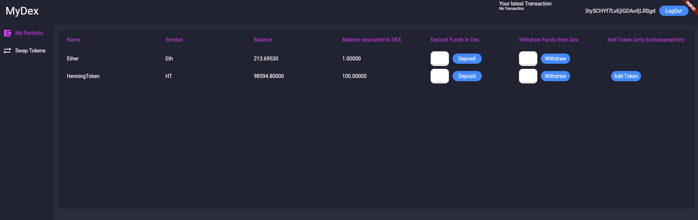
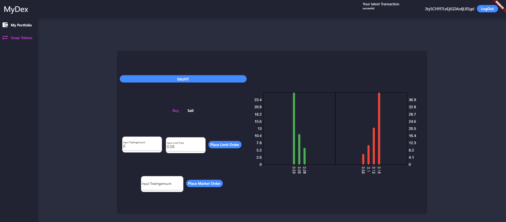

# MyDex

My Dex is a little project for a classical orderbook based decentralized exchange in solidity. I also added a basic webfrontend with flutter. All the Eth and Token balances are

fetched from Moralis.

This is how the portfolio side looks

And here you can see the tradingview

